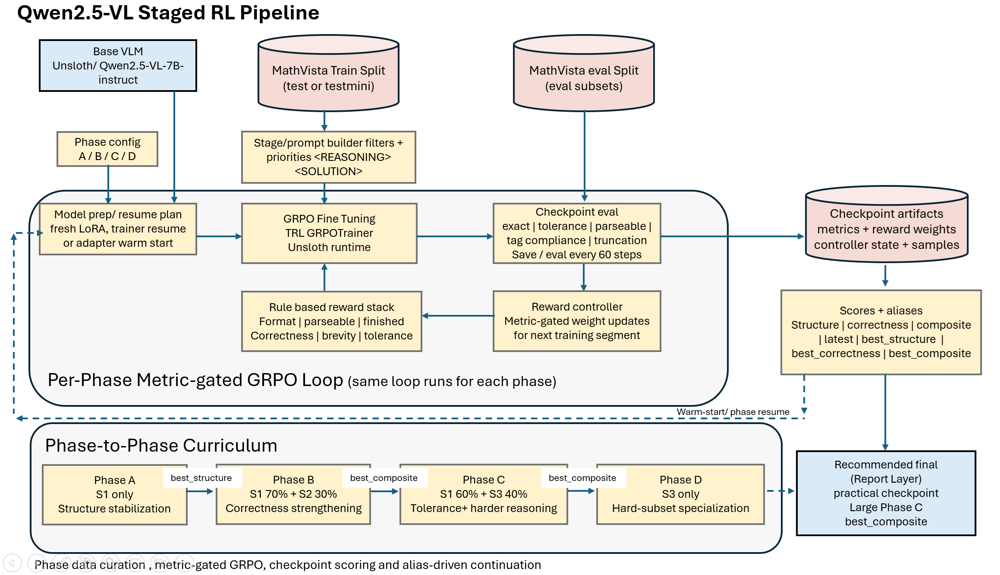
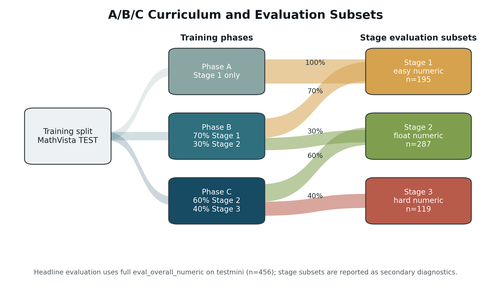
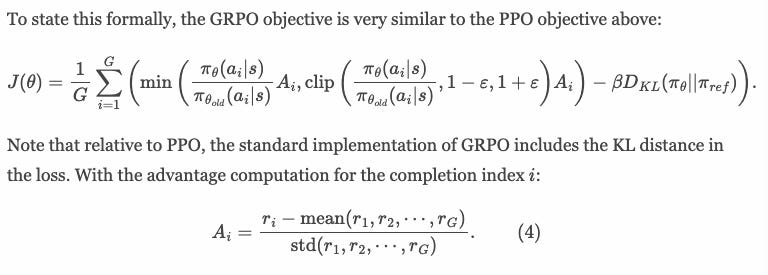
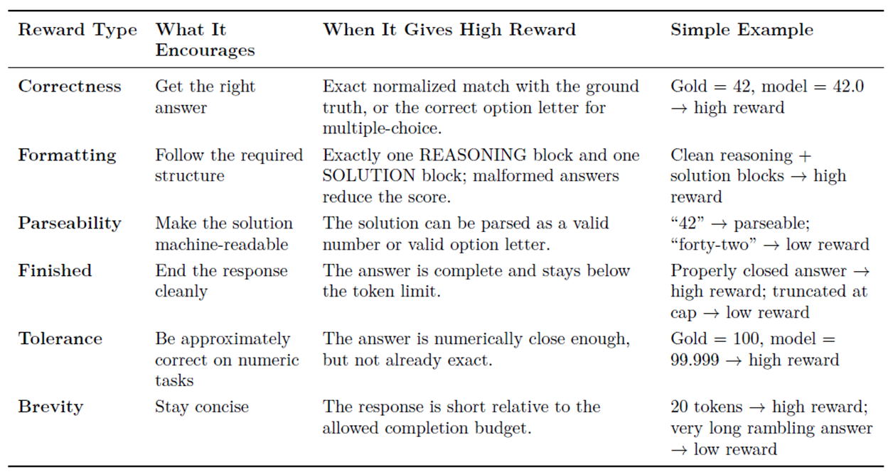
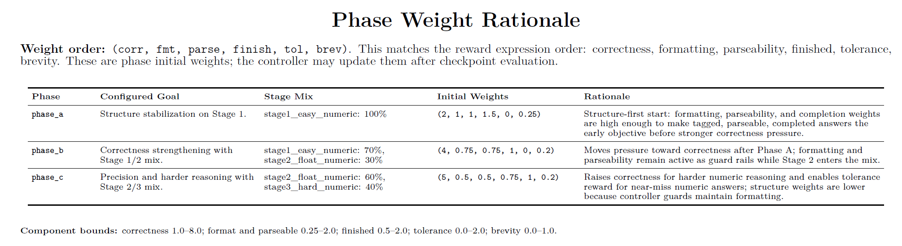
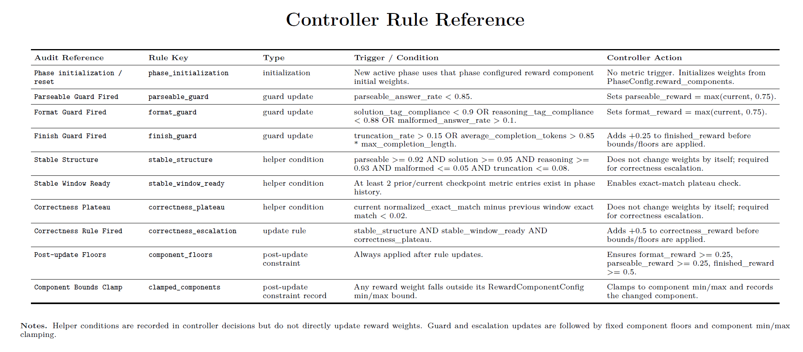
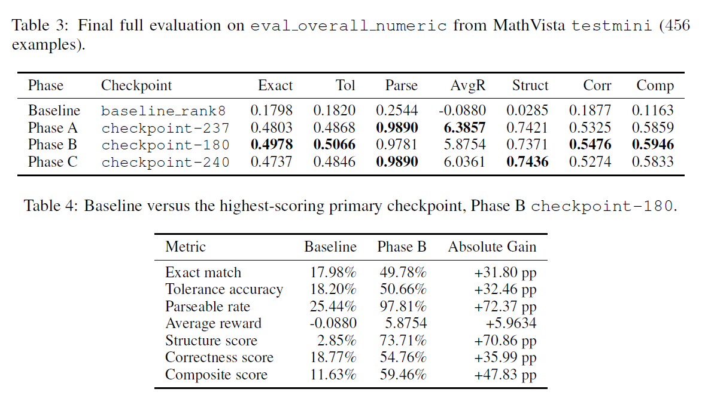
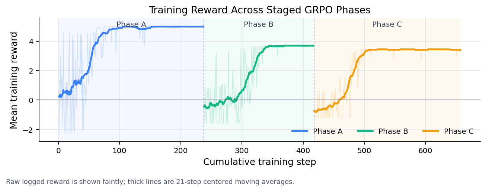
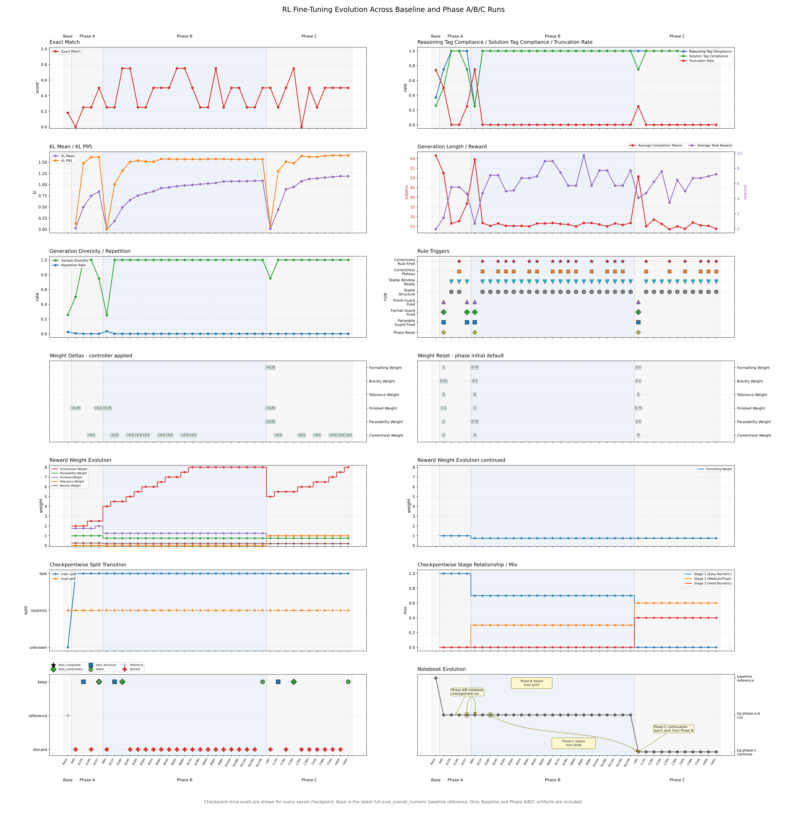

# Staged Metric-Gated GRPO Fine-Tuning Pipeline for Visual Numeric Reasoning

Visual-language models have become surprisingly capable at reading charts, diagrams, scientific figures, tables, and natural images. But when the answer is numeric, the problem changes. A model does not only need to "understand" the image. It needs to produce a final answer that is extractable, parseable, non-truncated, and numerically correct.

That distinction matters for reinforcement learning.

In many RL fine-tuning stories, reward design is treated as the center of gravity: define a reward, optimize the model, measure improvement. Visual numeric reasoning is less forgiving. If the model fails to follow the output format, or if the answer cannot be parsed, then a correctness reward becomes noisy. A wrong answer and an uncheckable answer look similar to the evaluator, even though they are different failures.

The paper **Staged Metric-Gated GRPO Fine-Tuning Pipeline for Visual Numeric Reasoning** studies this problem using a rank-8 LoRA adaptation of `Qwen2.5-VL-7B-Instruct` on MathVista-style numeric visual question answering.

The central idea is simple:

**Do not push hardest on correctness before the model reliably produces checkable answers.**

Instead, the pipeline first stabilizes response structure, then gradually increases correctness pressure through staged data mixtures and metric-gated reward updates.

Paper: [staged_metric_gated_grpo.pdf](https://github.com/kgaero/RL_GSPO_Qwen2.5_7B/blob/main/paper/staged_metric_gated_grpo.pdf)  
Code: [github.com/kgaero/RL_GSPO_Qwen2.5_7B](https://github.com/kgaero/RL_GSPO_Qwen2.5_7B)



*Figure 1. The staged metric-gated GRPO loop couples phase-specific data curation, GRPO fine-tuning, checkpoint-side evaluation, reward-weight adaptation, and alias-based continuation.*

## The Problem: Numeric Reasoning Is Not Just Accuracy

For visual numeric question answering, the target behavior has several prerequisites:

1. The model must look at the image and question.
2. It must reason about the relevant visual quantity.
3. It must emit a final numeric answer.
4. That answer must appear in a predictable location.
5. The evaluator must be able to parse it.
6. Only then can exact-match or tolerance-based correctness be measured cleanly.

The paper uses a strict response contract:

```text
<REASONING> ... </REASONING>
<SOLUTION> single numeric answer </SOLUTION>
```

This is not just formatting preference. It is part of the learning system. If the answer cannot be extracted from `<SOLUTION>`, then a verifiable numeric reward cannot do its job.

This is why the method treats success as a sequence of preconditions rather than one scalar metric. Early training asks: can the model consistently produce structured, parseable answers? Later training asks: can those answers become more correct?

## A Short GRPO Refresher

GRPO, or Group Relative Policy Optimization, is an RL fine-tuning method popularized in mathematical reasoning work. At a high level, it samples multiple completions for the same prompt, scores them with a reward function, and updates the model toward completions that score better relative to the group.

The useful intuition is:

**The model does not need an external value model to estimate whether an answer was good. It can compare several candidate answers for the same question using verifiable rewards.**

For numeric visual QA, that is attractive because reward can be computed from measurable properties:

- Did the answer use the required tags?
- Was the final numeric answer parseable?
- Did generation finish without truncation?
- Did the extracted answer match the gold answer?
- Was the answer within numeric tolerance?
- Was the response concise enough?

The work does not introduce a new GRPO loss. The contribution is the fine-tuning pipeline around GRPO: staged data, metric-gated rewards, checkpoint evaluation, and checkpoint-aware continuation.

## The Staged Curriculum

The method divides MathVista-style numeric tasks into three curriculum stages. These are filtered views over the same dataset family, not fixed disjoint datasets.

**Stage 1: Easy numeric stabilization**  
Easier English free-form integer questions over synthetic scenes, tables, and natural images.

**Stage 2: Medium and float numeric reasoning**  
Integer and floating-point answers over tables, charts, plots, scientific figures, and natural images.

**Stage 3: Hard numeric reasoning**  
Harder geometry, scientific-figure, plot, and abstract-scene problems that require more complex visual-mathematical reasoning.

Training then proceeds through phases:

| Phase | Data mixture | Main role |
|---|---:|---|
| Phase A | Stage 1 only | Structure stabilization |
| Phase B | 0.7 Stage 1 + 0.3 Stage 2 | Early correctness strengthening |
| Phase C | 0.6 Stage 2 + 0.4 Stage 3 | Harder reasoning and tolerance pressure |



*Figure 2. The A/B/C curriculum mixes stage-filtered subsets during training while comparing checkpoints on the same primary numeric evaluation subset.*

This staging matters because the model is not asked to solve the hardest visual numeric cases before it has learned how to answer in a stable, checkable form.

## Metric-Gated Rewards

The reward design sits inside the GRPO update. For each prompt, the policy samples a small group of candidate completions. Each completion receives a scalar reward, and GRPO converts those group-level rewards into relative advantages. In simple terms, a completion is reinforced when it scores better than the other completions sampled for the same prompt, while a KL term discourages the policy from drifting too far from the reference model.



*Figure 6. GRPO uses group-relative rewards to compute advantages. In this pipeline, the scalar reward is a weighted combination of correctness, formatting, parseability, completion, tolerance, and brevity terms.*

The important design question is therefore not only "what is the GRPO loss?" It is also "what scalar reward enters the advantage calculation?"

Here, the reward is a weighted sum of six components:

```text
total reward =
  correctness_weight * correctness_reward
+ formatting_weight  * formatting_reward
+ parseability_weight * parseability_reward
+ finished_weight    * finished_reward
+ tolerance_weight   * tolerance_reward
+ brevity_weight     * brevity_reward
```

Each term protects a different part of the behavior. Correctness rewards the right numeric answer. Formatting rewards the required `<REASONING>` and `<SOLUTION>` structure. Parseability rewards a machine-readable final answer. Finished rewards non-truncated completions. Tolerance rewards numerically close answers when exact match is too strict. Brevity discourages rambling completions that waste the limited generation budget.



*Figure 7. Reward components used by the verifier. The reward is not only about correctness; it also protects the structural conditions that make correctness measurable.*

This decomposition is what makes the staged pipeline possible. Early training can emphasize structure without turning correctness off. Later training can increase correctness pressure while still keeping format, parseability, and completion constraints active.

At the start of each phase, the controller initializes the reward weights according to the phase goal:

- Phase A is structure-first: it gives high pressure to correctness, formatting, parseability, and completion, while tolerance is inactive.
- Phase B raises correctness pressure after Phase A has stabilized the answer format.
- Phase C raises correctness again and activates tolerance reward for harder numeric examples where near misses are informative.



*Figure 8. Initial reward weights for each phase. The order is correctness, formatting, parseability, finished, tolerance, and brevity.*

The key design choice is that these weights are not treated as a single fixed schedule. They can be adjusted after checkpoint evaluation.

For example:

- If parseability is too low, the controller protects or raises parseability reward.
- If tag compliance drops, it protects formatting reward.
- If truncation rises, it increases pressure to finish properly.
- Correctness pressure increases only after structure has become stable.

The controller implements this with explicit metric gates. A parseability guard fires when the parseable-answer rate falls below the configured threshold. A format guard fires when solution-tag compliance, reasoning-tag compliance, or malformed-answer rate crosses a failure threshold. A finish guard fires when truncation or completion length becomes risky. Correctness escalation is more conservative: it requires stable structure, enough checkpoint history, and a plateau in exact-match improvement.



*Figure 9. Controller rule reference. Reward weights are updated only after checkpoint-side metrics show which failure mode currently dominates.*

This is the "metric-gated" part of the method. The training system looks at actual checkpoint behavior before changing reward pressure.

That is a practical difference from a hand-written epoch schedule. A fixed schedule says, "after N steps, increase correctness." A metric-gated schedule says, "increase correctness only once the model is producing outputs that make correctness meaningful."

## Checkpoint Aliases: The Latest Checkpoint Is Not Always the Best One

RL fine-tuning is often non-monotonic. The latest checkpoint may not be the best checkpoint for structure, correctness, or a combined score.

The pipeline therefore evaluates checkpoints and assigns aliases such as:

- `latest`
- `best_structure`
- `best_correctness`
- `best_composite`

These aliases are not cosmetic. They control continuation decisions. A later phase can resume from a checkpoint that best satisfies the next phase's purpose, rather than blindly continuing from the most recent checkpoint.

This is especially important in a staged setting. Phase A is primarily about structure. Phase B is where correctness rises. Phase C emphasizes harder subsets. A single "latest is best" rule does not capture those shifts.

## Experimental Setup

The reported experiments use:

- Base model: `unsloth/Qwen2.5-VL-7B-Instruct`
- Adaptation: rank-8 LoRA, alpha 8
- Loading: 4-bit, memory-constrained runtime profile
- Dataset: MathVista from `AI4Math/MathVista`
- Training split: MathVista `test` in the project setup
- Final reporting split: MathVista `testmini`
- Primary evaluation subset: `eval_overall_numeric`
- Primary evaluation size: 456 examples
- Final evaluation sampling: one completion per prompt
- Final evaluation cap: none

The final comparison evaluates the baseline adapter and the selected Phase A, Phase B, and Phase C checkpoints under the same evaluation protocol.

## Results: Structure First, Correctness Later

The strongest primary result comes from Phase B, checkpoint 180.

On the full `eval_overall_numeric` subset of MathVista `testmini`, Phase B improves exact match from **17.98%** to **49.78%** and tolerance accuracy from **18.20%** to **50.66%**.

The structural improvement is even more dramatic: parseability rises from **25.44%** to **97.81%**.



*Figure 3. Final full evaluation on `eval_overall_numeric` from MathVista `testmini`, with Phase B obtaining the highest primary exact match, tolerance accuracy, correctness score, and composite score.*

The main benchmark table is:

| Phase | Checkpoint | Exact | Tol | Parse | AvgR | Struct | Corr | Comp |
|---|---|---:|---:|---:|---:|---:|---:|---:|
| Baseline | `baseline_rank8` | 0.1798 | 0.1820 | 0.2544 | -0.0880 | 0.0285 | 0.1877 | 0.1163 |
| Phase A | `checkpoint-237` | 0.4803 | 0.4868 | **0.9890** | **6.3857** | 0.7421 | 0.5325 | 0.5859 |
| Phase B | `checkpoint-180` | **0.4978** | **0.5066** | 0.9781 | 5.8754 | 0.7371 | **0.5476** | **0.5946** |
| Phase C | `checkpoint-240` | 0.4737 | 0.4846 | **0.9890** | 6.0361 | **0.7436** | 0.5274 | 0.5833 |

Compared with the baseline, the best Phase B checkpoint gives:

| Metric | Baseline | Phase B | Absolute gain |
|---|---:|---:|---:|
| Exact match | 17.98% | 49.78% | +31.80 pp |
| Tolerance accuracy | 18.20% | 50.66% | +32.46 pp |
| Parseable rate | 25.44% | 97.81% | +72.37 pp |
| Average reward | -0.0880 | 5.8754 | +5.9634 |
| Structure score | 2.85% | 73.71% | +70.86 pp |
| Correctness score | 18.77% | 54.76% | +35.99 pp |
| Composite score | 11.63% | 59.46% | +47.83 pp |

The pattern is the important part.

Phase A produces the biggest structural transition. It makes outputs parseable and well-formed. Phase B then gives the highest correctness and composite scores. Phase C improves the hardest diagnostic subset, but does not beat Phase B on the aggregate primary numeric subset.

That is a useful result because it shows why checkpoint-aware continuation matters. More training on harder data is not guaranteed to dominate a previous checkpoint on every metric.

## Training Reward Is a Diagnostic, Not the Final Score

The reward plot shows a tempting but important caveat: logged reward across phases should not be read as a single comparable metric.

Each phase uses different reward weights. Phase A reaches high reward quickly because structure rewards are easier to satisfy once the model learns the contract. Phases B and C operate under stronger correctness pressure, so their absolute logged reward can be lower even while downstream evaluation improves.



*Figure 4. Training reward across selected Phase A-C runs. Faint lines show raw per-step reward values; thick lines show centered moving averages.*

The figure is best read as a within-pipeline diagnostic: it shows the transition from structure stabilization to correctness pressure.

## Stage-Wise Diagnostics

The paper also reports diagnostic evaluations on the stage-specific subsets. These are not the headline metric, but they help explain where behavior changes.

| Phase | Eval subset | Exact | Tol | Parse | Trunc |
|---|---|---:|---:|---:|---:|
| Baseline | Stage 1 | 0.1641 | 0.1641 | 0.2872 | 0.6923 |
| Baseline | Stage 2 | 0.1220 | 0.1220 | 0.1672 | 0.8293 |
| Baseline | Stage 3 | 0.0924 | 0.0924 | 0.1681 | 0.8151 |
| Phase A | Stage 1 | 0.4615 | 0.4615 | **0.9897** | 0.0051 |
| Phase A | Stage 2 | 0.4321 | 0.4460 | **0.9895** | 0.0000 |
| Phase A | Stage 3 | 0.3950 | 0.4034 | 0.9832 | 0.0084 |
| Phase B | Stage 1 | **0.4718** | **0.4718** | 0.9846 | 0.0000 |
| Phase B | Stage 2 | **0.4774** | **0.4983** | 0.9721 | 0.0035 |
| Phase B | Stage 3 | 0.3866 | 0.4118 | 0.9664 | 0.0000 |
| Phase C | Stage 1 | 0.4564 | 0.4564 | 0.9692 | 0.0000 |
| Phase C | Stage 2 | 0.4321 | 0.4530 | 0.9861 | 0.0000 |
| Phase C | Stage 3 | **0.4202** | **0.4286** | 0.9832 | 0.0000 |

All trained phases improve over baseline on every diagnostic subset. Phase B is strongest on Stage 1 and Stage 2 exact match. Phase C is strongest on Stage 3 exact match.

This supports the curriculum interpretation: Phase C does specialize toward harder diagnostic examples, but that specialization does not produce the best overall primary score.



*Figure 5. Training evolution across checkpoint-side milestones. The panel view helps diagnose the structure-first, correctness-later trajectory and the cross-phase checkpoint handoffs.*

## Why This Matters

The most interesting part of the work is not that one checkpoint beats another. It is the training-system lesson:

**In verifiable multimodal RL, correctness reward is only as useful as the model's ability to produce verifiable outputs.**

For numeric visual reasoning, early RL can be wasted if the model frequently emits malformed, unparseable, or truncated answers. In that regime, a correctness failure is ambiguous. The model may not have reasoned incorrectly; it may simply have failed to produce an answer the evaluator can read.

The staged metric-gated pipeline addresses this by making structural reliability an explicit training target before turning up correctness pressure.

This is a practical engineering pattern:

- Start with the easiest tasks that teach the response contract.
- Keep structure rewards active even after correctness becomes the main goal.
- Use checkpoint metrics to decide when reward weights should change.
- Track multiple checkpoint aliases because optimization is non-monotonic.
- Evaluate final checkpoints under the same fixed protocol.

These choices are not glamorous, but they are the difference between a reward function that looks good on paper and an RL system that can be audited.

## Limitations and Future Work

The result is encouraging, but it should be read with the paper's constraints in mind.

First, the final primary evaluation uses the full numeric `testmini` subset, but it is still one evaluation split with one sampled completion per prompt. A broader evaluation would need more held-out data, more sampling analysis, and ideally additional benchmark families.

Second, the reported runs use one base model family, one LoRA rank, one constrained runtime profile, and no seed sweep. The results show that the staged metric-gated design works in this setting; they do not prove that the same exact phase schedule is optimal across models or hardware regimes.

Third, training uses the MathVista `test` split in the project setup and final reporting uses `testmini`. That makes the reported comparison controlled within the project, but broader benchmark-level claims would require a more conventional held-out validation and test separation.

Fourth, checkpoint selection is guided by checkpoint-side diagnostics. Future work should separate checkpoint selection from final reporting with an additional validation split when compute permits.

Finally, the implementation includes preliminary support for multi-choice handling and an optional robustness stage, but those are not part of the main evidence in the paper.

The natural next step is to test whether the same structure-first, metric-gated pattern transfers to other VLMs, other visual reasoning benchmarks, and larger training runs.

## Closing

Staged Metric-Gated GRPO is not a new RL objective. It is a training pipeline that treats visual numeric reasoning as a staged systems problem.

The strongest Phase B checkpoint improves exact match from **17.98%** to **49.78%**, tolerance accuracy from **18.20%** to **50.66%**, parseability from **25.44%** to **97.81%**, and composite score from **11.63%** to **59.46%** on the same 456-example numeric `testmini` subset.

The broader lesson is that RL fine-tuning for multimodal numeric reasoning should not rush toward correctness before the model can produce checkable outputs. Stabilize the contract first. Then make the model smarter within that contract.

That is the core idea behind the staged metric-gated pipeline.
